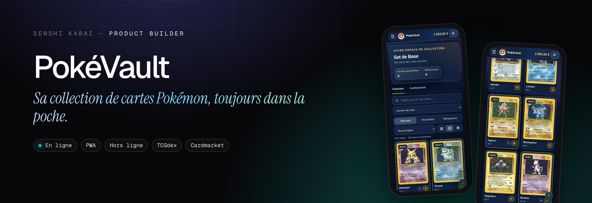
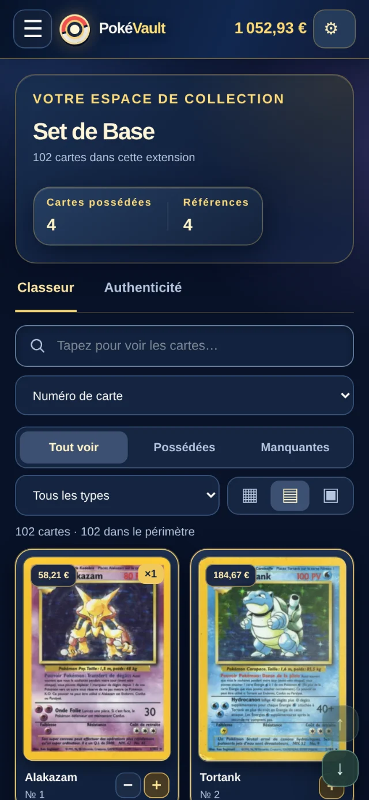
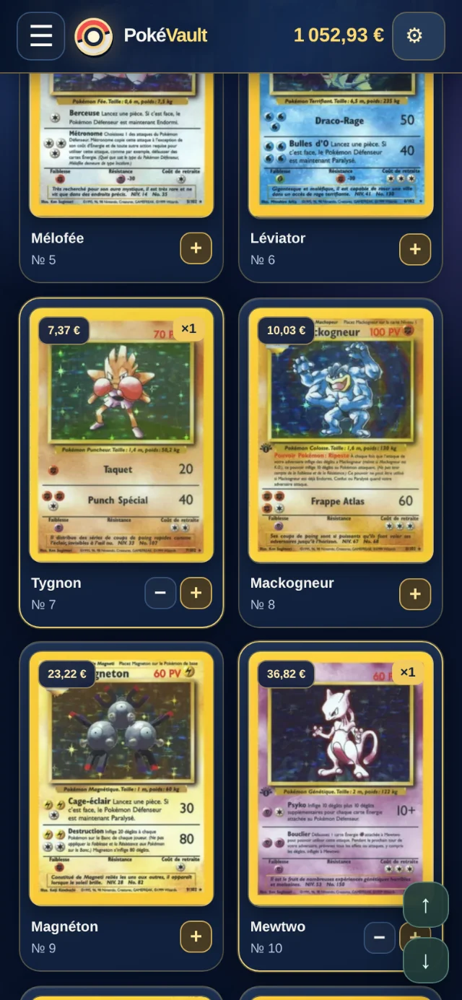

<p align="center"><a href="https://engob.github.io/PokeTest/"></a></p>

<p align="center">
  <a href="https://engob.github.io/PokeTest/"></a>
  <a href="https://www.senshicore.com/projets/pokevault/"></a>
</p>

<h1 align="center">PokéVault</h1>
<p align="center"><b>Sa collection de cartes Pokémon, toujours dans la poche.</b><br>Un classeur numérique rapide pour suivre sa collection, retrouver les visuels officiels et connaître la cote de chaque carte, même hors connexion.</p>
<p align="center"><sub>Statut : <b>En ligne</b></sub></p>

> **Pensé pour le téléphone.** C'est une application web installable (PWA) : ouvrez la démo sur votre mobile pour la voir telle qu'elle a été conçue. Sur un ordinateur, l'affichage n'est pas celui prévu ; la [fiche du portfolio](https://www.senshicore.com/projets/pokevault/) l'ouvre dans un cadre de téléphone, avec un QR code pour passer sur mobile.

---

### Le problème

Suivre des milliers de cartes, avec les bons visuels et des prix fiables, sans compte, sans abonnement et même sans réseau.

### L'idée

Une app « local d'abord » : tout reste sur l'appareil, et plusieurs catalogues se relaient pour ne jamais afficher une mauvaise carte.

### Comment c'est fait

Application web installable en JavaScript natif, cache local et mode hors ligne, cotes Cardmarket, tests automatisés.

**Outils** &nbsp; `PWA` `Hors ligne` `TCGdex` `Cardmarket`

### Aperçu

<p align="center"> </p>

### Mentions

Projet personnel et non commercial, **non affilié** à Nintendo, Creatures ou The Pokémon Company. Pokémon et les noms associés sont des marques de leurs propriétaires ; les illustrations de cartes restent la propriété de leurs ayants droit. Données de cartes : TCGdex.

### English

**PokéVault** — *Your Pokémon card collection, always in your pocket.* A fast digital binder to track your collection, find official artwork and see each card's value, even offline.

Tracking thousands of cards with the right artwork and reliable prices — no account, no subscription, even without a connection. A local-first app: everything stays on the device, and several catalogues back each other up so the wrong card is never shown. An installable web app in plain JavaScript, local cache and offline mode, Cardmarket prices, automated tests.

---

<p align="center"><sub>Conçu, développé et mis en ligne par <b>Senshi Kabai</b>, Product Builder · <a href="https://www.senshicore.com/">portfolio</a> · <a href="https://www.senshicore.com/projets/pokevault/">fiche du projet</a><br>© 2026 Senshi Kabai — tous droits réservés.</sub></p>


<details>
<summary><b>Documentation technique</b> · notes de développement et de mise en ligne</summary>

## PokéVault

**Votre classeur de cartes Pokémon, partout avec vous.** Une application web progressive (PWA) en français pour explorer le catalogue, suivre sa collection et retrouver ses cartes, sur téléphone comme sur ordinateur.

[](https://github.com/engoB/PokeTest/actions/workflows/verify.yml)


**[Ouvrir PokéVault ↗](https://engob.github.io/PokeTest/)** · [Suivre les déploiements](https://github.com/engoB/PokeTest/actions) · [Signaler un problème](https://github.com/engoB/PokeTest/issues)

> Projet indépendant, non affilié à The Pokémon Company. Les prix sont indicatifs ; les illustrations restent la propriété de leurs ayants droit.

### L'expérience PokéVault

| Fonctionnalité | Ce que propose la v5.1.1 |
| --- | --- |
| Catalogue français | 22 170 références dans le snapshot FR du 24 septembre 2026, classées par extension. |
| Recherche immédiate | Filtrage dès la saisie, suggestions avec extension et numéro, navigation au clavier. |
| Collection personnelle | Quantités possédées, filtres « Possédées / Manquantes », import et export JSON. |
| Interface personnalisable | Thème bleu nuit, or et rouge ; animations de cartes et affichage des cotes activables dans **⚙ Options**. |
| Cotes par finition | Cote Standard par défaut lorsqu’elle existe ; sélection holographique ou reverse uniquement dans la fiche ouverte. Une moyenne 30 jours disponible sans tendance est marquée ≈. |
| Achat | Lien direct Cardmarket uniquement lorsqu'une fiche produit exacte est connue ; sinon, recherche explicite. |
| Illustrations | Moisson GitHub et bibliothèque GitHub Pages gratuite, chargée à la demande après publication de scans autorisés ; compteur distinct des images réellement vérifiées. |
| Confort | Grille virtualisée, trois tailles de cartes, navigation rapide, interface adaptée au mobile. |

Les animations respectent la préférence système de réduction des mouvements. Une carte sans prix connu n'est **jamais** considérée comme valant 0 € ; une cote statistique n'est ni une offre de vente ni une garantie de correspondance avec une annonce Cardmarket.

### Utiliser l'application

1. Ouvrir **[PokéVault](https://engob.github.io/PokeTest/)** dans un navigateur récent. Sur mobile, utiliser « Ajouter à l'écran d'accueil » pour l'installer comme PWA.
2. Rechercher une carte ou choisir une extension, ouvrir sa fiche et ajuster la quantité possédée.
3. Utiliser **Exporter** pour conserver régulièrement une sauvegarde JSON de sa collection. **Importer** fusionne une sauvegarde avec la collection présente.

La collection est conservée **sur l'appareil**, sous la clé `pv_collection`. Il n'y a ni compte utilisateur ni synchronisation cloud. Avant de désinstaller la PWA, d'effacer les données du navigateur ou de changer de domaine, exporter la collection : les données locales ne suivent pas automatiquement.

La PWA conserve les ressources et images déjà consultées dans les limites de stockage du navigateur. Elle ne garantit pas que les 22 170 illustrations soient accessibles hors connexion.

### Illustrations : recherche automatisée

Le workflow **[PokéVault – moisson d'illustrations](https://github.com/engoB/PokeTest/actions/workflows/harvest-images.yml)** exécute `resolve` quatre fois par jour, à **02:21, 08:21, 14:21 et 20:21 UTC** (les horaires GitHub peuvent être décalés). Chaque passage traite jusqu'à 400 cartes FR non résolues ou à revérifier et conserve son état pour la suite.

- **`resolve`** cherche des URL d'images pour les identifiants exacts du catalogue français, à travers les locales TCGdex et les sources secondaires gratuites disponibles. Il distingue les visuels trouvés, les erreurs ou quotas à réessayer et les visuels indisponibles dans les sources effectivement vérifiées.
- **`pokevault-image-audit`** fournit le rapport de couverture, les identifiants restants et les raisons des échecs ; **`pokevault-image-state`** permet la reprise. Une sauvegarde des métadonnées est également prévue sur la branche `pokevault-image-data`.
- **`pack`**, facultatif, télécharge et valide les fichiers physiques en 16 lots, puis **`assemble`** produit l'inventaire du pack. Cette étape ne doit être lancée qu'après vérification des droits d'utilisation et de redistribution des scans.

**Une URL indexée n'est pas une image téléchargée.** Une carte « introuvable » signifie seulement qu'aucun visuel valide n'a été obtenu dans les sources testées à ce stade. Les rapports GitHub Actions donnent l'état daté de la recherche ; ils ne prouvent pas qu'une illustration n'existe nulle part.

**Synchronisation v4.9.1 :** l'application consulte automatiquement l'index de la branche `pokevault-image-data` et le réactualise toutes les six heures. Les compteurs techniques (URL indexées par GitHub et visuels réellement chargés sur cet appareil) se consultent uniquement dans **⚙ Options → État des visuels** ; le classeur reste dédié aux cartes. En cas d'indisponibilité, une copie en cache puis l'index du dépôt prennent le relais. Aucun effacement de collection ni relance manuelle de la moisson n'est nécessaire.

Documentation : [fonctionnement de la moisson](WORK-MOISSON-VISUELS.md) · [automatisation des visuels](AUTOMATISATION-VISUELS.md) · [validation du périmètre FR](VALIDATION-MOISSON-FR.md).

### Installation locale et vérification

**Prérequis :** Node.js 20 ou supérieur et Python 3 pour le serveur de développement. L'interface utilise HTML, CSS et JavaScript natifs, sans compilation nécessaire pour ouvrir le site.

```bash
git clone https://github.com/engoB/PokeTest.git
cd PokeTest

# Démarrer un serveur HTTP local
npm run dev
# Ouvrir http://localhost:4173

# Vérifier le bundle, la syntaxe et les tests
npm run check
```

Ne pas ouvrir `index.html` en `file://` : le service worker et certaines ressources nécessitent HTTP ou HTTPS.

| Élément | Rôle |
| --- | --- |
| `index.html`, `style.css` | Interface et présentation. |
| `app.bundle.js`, `app.js`, `core.mjs` | Démarrage et logique applicative. |
| `db.mjs`, `image-state.mjs`, `virtual-grid.mjs` | Cache local, illustrations et performances du catalogue. |
| `sw.js`, `manifest.webmanifest` | Installation PWA, mise en cache et fonctionnement hors connexion partiel. |
| `scripts/`, `inputs/`, `tests/` | Outils de catalogue et d'images, données d'entrée et tests. |
| `.github/workflows/` | Vérification du code et moisson planifiée. |

Les commandes de construction du catalogue et du pack sont décrites dans [WORK-CATALOGUE.md](WORK-CATALOGUE.md) et [WORK-MOISSON-VISUELS.md](WORK-MOISSON-VISUELS.md). Aucun scan tiers n’est inclus par défaut ; seuls des fichiers dont la redistribution publique a été confirmée peuvent être ajoutés dans `assets/library/`.

### Publication sur GitHub Pages

Le site public est hébergé à **https://engob.github.io/PokeTest/**. La branche de publication attendue est `main`, dossier `/(root)`, avec la source **Deploy from a branch** dans [Settings → Pages](https://github.com/engoB/PokeTest/settings/pages).

Un push sur `main` déclenche [**Verify PWA**](https://github.com/engoB/PokeTest/actions/workflows/verify.yml), qui exécute `npm run check`. **La réussite de ces tests ne signifie pas à elle seule que GitHub Pages a déployé la nouvelle interface** : attendre également la réussite de **pages build and deployment** dans [Actions](https://github.com/engoB/PokeTest/actions).

Si l’ancienne interface reste affichée après le déploiement, recharger sans cache (`Ctrl+Maj+R` sur ordinateur), puis fermer et rouvrir la PWA installée. La v5.1 utilise `app.bundle.js?v=5.1.0` et le service worker `pv-v5.1`. Ne pas effacer les données du site pour tenter une mise à jour sans avoir exporté la collection.

### Confidentialité, données et limites

- **Collection :** stockée localement dans le navigateur ; les exports JSON restent sous le contrôle de l'utilisateur.
- **Catalogue et cotes :** fournis notamment par [TCGdex](https://tcgdex.dev/). Les données de marché sont indicatives, peuvent manquer et dépendent de la finition, de la langue et de l'état.
- **Illustrations :** chargées depuis leurs fournisseurs ou depuis un pack local autorisé. Les scans et marques Pokémon ne sont pas cédés par ce dépôt ; vérifier les licences et conditions des fournisseurs avant toute redistribution.
- **Hors connexion :** la PWA peut réutiliser les données et images déjà mises en cache, sous réserve des quotas propres au navigateur.

Pour publier gratuitement des images autorisées sur GitHub Pages, consulter [le guide v5.1](BIBLIOTHEQUE-VISUELS-v5.md). Pour la synchronisation des visuels et les nouvelles icônes, consulter [les notes v4.9](MISE-A-JOUR-v4.9.md) ; les [notes v4.8](MISE-A-JOUR-v4.8.md) détaillent l'interface précédente. Pour les évolutions envisagées des prix, consulter [la feuille de route](ROADMAP-COTES.md).

---

*PokéVault est un projet de collection indépendant, non officiel et non affilié à Nintendo, Creatures Inc., GAME FREAK ou The Pokémon Company.*

### v5.1 — bibliothèque GitHub gratuite et finitions dans les fiches

Le stockage payant a été remplacé par une **bibliothèque incrémentale sur GitHub Pages** (`assets/library/`). Un workflow manuel, soumis à confirmation des droits de redistribution, peut y publier les images en lots bornés. Le manifeste est initialement vide ; les fournisseurs externes restent actifs tant qu'aucun fichier autorisé n'est ajouté. La finition se choisit **uniquement dans la fiche d'une carte** ; le catalogue n'affiche plus « Choisir finition ». Les limites de GitHub Pages sont respectées par un plafond de 650 Mio de fichiers. [Guide complet](BIBLIOTHEQUE-VISUELS-v5.md).

</details>
